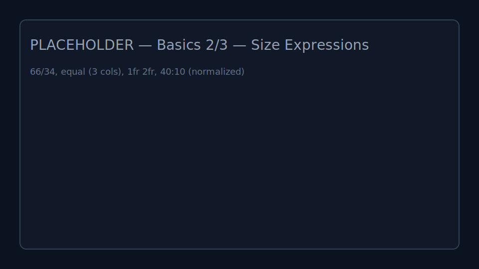
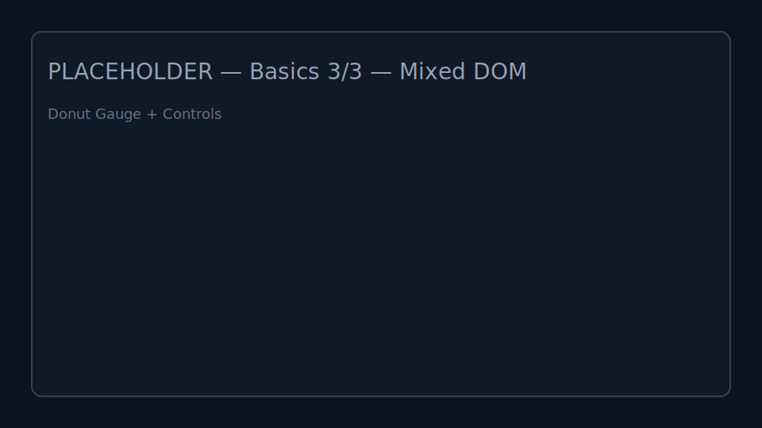
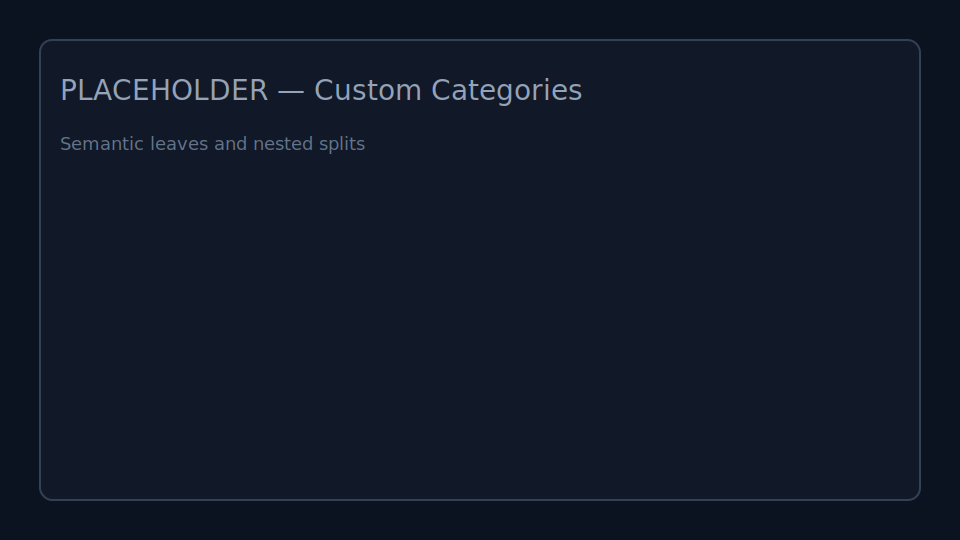

# Tweakpane Compact Kit

Compact layout toolkit for Tweakpane v4 — build dense, tidy panels in ~320px.

- SplitLayout: split by rows/columns and mount panes/DOM per slot
- SizedButton: multi-line buttons aligned to Tweakpane grid units
- Optional compact slider/value layout

## Install

```bash
npm install tweakpane-compact-kit
```

Peer dependency: tweakpane v4

## Quick Start — First Split

<table><tr><td>

<pre><code class="language-ts">import { Pane } from 'tweakpane';
import { CompactKitBundle } from 'tweakpane-compact-kit';

const pane = new Pane();
pane.registerPlugin(CompactKitBundle); // per Pane

// 1fr | 1fr
const row = pane.addBlade({
  view: 'split-layout', direction: 'row', sizes: '1fr 1fr', children: ['leaf', 'leaf']
});
const [L, R] = (row as any).getSlots();

// Left: 3u button
const pL = new Pane({ container: L });
pL.registerPlugin(CompactKitBundle);
pL.addBlade({ view: 'sized-button', title: 'button (3u)', units: 3 });

// Right: 3u DOM
const box = document.createElement('div');
box.style.height = 'calc(3 * var(--cnt-usz) + 2 * 4px)';
box.style.display = 'grid';
box.style.placeItems = 'center';
box.textContent = '3u DOM';
R.appendChild(box);
</code></pre>

</td><td style="width:50%;" valign="top">


</td></tr></table>

## Size Expressions

<table><tr><td>

<pre><code class="language-ts">import { Pane } from 'tweakpane';
import { CompactKitBundle } from 'tweakpane-compact-kit';

const pane = new Pane();
pane.registerPlugin(CompactKitBundle);

// 66 / 34
const rA = pane.addBlade({ view: 'split-layout', direction: 'row', sizes: [66, 34], children: ['leaf','leaf'] }) as any;
rA.getSlots().forEach((slot, i) => {
  const p = new Pane({ container: slot });
  p.registerPlugin(CompactKitBundle);
  p.addBlade({ view: 'sized-button', title: i === 0 ? '66%' : '34%', units: 2 });
});

// equal (3 cols)
const rB = pane.addBlade({ view: 'split-layout', direction: 'row', sizes: 'equal', children: ['leaf','leaf','leaf'] }) as any;
rB.getSlots().forEach((slot, i) => {
  const p = new Pane({ container: slot });
  p.registerPlugin(CompactKitBundle);
  p.addBlade({ view: 'sized-button', title: `Equal`, units: 2 });
});

// 1fr 2fr
const rC = pane.addBlade({ view: 'split-layout', direction: 'row', sizes: '1fr 2fr', children: ['leaf','leaf'] }) as any;
rC.getSlots().forEach((slot, i) => {
  const p = new Pane({ container: slot });
  p.registerPlugin(CompactKitBundle);
  p.addBlade({ view: 'sized-button', title: i === 0 ? '1fr' : '2fr', units: 2 });
});

// 40 10 (normalized: 40:10 → 80:20)
const rD = pane.addBlade({ view: 'split-layout', direction: 'row', sizes: [40, 10], children: ['leaf','leaf'] }) as any;
rD.getSlots().forEach((slot) => {
  const p = new Pane({ container: slot });
  p.registerPlugin(CompactKitBundle);
  p.addBlade({ view: 'sized-button', title: 'Normalized', units: 2 });
});
</code></pre>

</td><td style="width:50%;" valign="top">



</td></tr></table>

## Mixed DOM — Donut Gauge

<table><tr><td>

<pre><code class="language-ts">import { Pane } from 'tweakpane';
import { CompactKitBundle } from 'tweakpane-compact-kit';

const pane = new Pane();
pane.registerPlugin(CompactKitBundle);

// Row: controls | gauge canvas
const gRow = pane.addBlade({ view: 'split-layout', direction: 'row', sizes: '1fr 1fr', gutter: 6, children: ['leaf','leaf'] }) as any;
const [gL, gR] = gRow.getSlots();
const state = { value: 64, thickness: 10, rounded: true, color: '#22d3ee' };

// left controls
const pL = new Pane({ container: gL });
pL.addBinding(state, 'value', { min: 0, max: 100, label: 'Value' });
pL.addBinding(state, 'thickness', { min: 4, max: 20, step: 1, label: 'Thickness' });
pL.addBinding(state, 'rounded', { label: 'Rounded' });
pL.addBinding(state, 'color', { label: '' });

// right gauge (4u)
const host = document.createElement('div');
host.style.height = 'calc(4 * var(--cnt-usz) + 3 * 4px)';
host.style.display = 'grid';
host.style.placeItems = 'center';
gR.appendChild(host);

function drawGauge(root: HTMLElement) {
  const canvas = document.createElement('canvas');
  const dpr = window.devicePixelRatio || 1;
  const w = root.clientWidth, h = root.clientHeight;
  canvas.width = Math.max(1, Math.floor(w * dpr));
  canvas.height = Math.max(1, Math.floor(h * dpr));
  canvas.style.width = '100%'; canvas.style.height = '100%';
  const ctx = canvas.getContext('2d'); if (!ctx) return;
  ctx.scale(dpr, dpr);
  const cx = w / 2, cy = h / 2; const r = Math.min(cx, cy) - state.thickness;
  // track
  ctx.lineWidth = state.thickness; ctx.strokeStyle = 'rgba(255,255,255,0.1)'; ctx.beginPath(); ctx.arc(cx, cy, r, 0, Math.PI*2); ctx.stroke();
  // value arc
  const start = -Math.PI/2, end = start + (Math.max(0, Math.min(100, state.value))/100) * Math.PI*2;
  ctx.lineCap = state.rounded ? 'round' : 'butt'; ctx.strokeStyle = state.color; ctx.beginPath(); ctx.arc(cx, cy, r, start, end); ctx.stroke();
  // text
  ctx.fillStyle = '#e5e7eb'; ctx.font = `${Math.floor(Math.min(w,h)*0.28)}px system-ui`; ctx.textAlign='center'; ctx.textBaseline='middle';
  ctx.fillText(`${Math.round(state.value)}%`, cx, cy);
  root.appendChild(canvas);
}

drawGauge(host);
</code></pre>

</td><td style="width:50%;" valign="top">



</td></tr></table>

## Compact Sliders Toggle

<table><tr><td>

<pre><code class="language-ts">import { Pane } from 'tweakpane';
import { CompactKitBundle } from 'tweakpane-compact-kit';

const pane = new Pane();
pane.registerPlugin(CompactKitBundle);

// original (top)
pane.addBlade({ view: 'split-layout', direction: 'row', sizes: '1fr 1fr', compactSliders: false, children: ['leaf','leaf'] });

// compact (bottom)
pane.addBlade({ view: 'split-layout', direction: 'row', sizes: '1fr 1fr', compactSliders: true, children: ['leaf','leaf'] });
</code></pre>

</td><td style="width:50%;" valign="top">


</td></tr></table>

## Custom Categories

<table><tr><td>

<pre><code class="language-ts">import { Pane } from 'tweakpane';
import { CompactKitBundle } from 'tweakpane-compact-kit';

const pane = new Pane();
pane.registerPlugin(CompactKitBundle);

const api = pane.addBlade({ view: 'split-layout', direction: 'row', sizes: 'equal', children: ['alpha','beta','gamma'] }) as any;
const [A,B,C] = api.getSlots();
new Pane({ container: A }).addButton({ title: 'Action' });
new Pane({ container: B }).addBinding({ level: 50 }, 'level', { min: 0, max: 100 });
new Pane({ container: C }).addBinding({ on: true }, 'on');
</code></pre>

</td><td style="width:50%;" valign="top">



</td></tr></table>

## API Quick Reference

```ts
// split layout
pane.addBlade({ view: 'split-layout', direction: 'row', sizes: '1fr 2fr', children: ['leaf','leaf'] });

// slots
api.getSlots();
api.getSlotsByCategory?.('alpha');

// vertical units
pane.addBlade({ view: 'split-layout', direction: 'column', rowUnits: '1 1 2', children: ['leaf','leaf','leaf'] });

// compact sliders
pane.addBlade({ view: 'split-layout', compactSliders: true, children: ['leaf'] });

// sized button
pane.addBlade({ view: 'sized-button', title: 'Multi-line\nButton', units: 3 });
```

Size Expressions (pick what reads best for your case):

```ts
// Numeric arrays (auto-normalized ratios)
sizes: [66, 34]       // 66:34 ratio
sizes: [1, 2, 1]      // 1:2:1 ratio

// Fractions (CSS Grid-like, recommended)
sizes: '1fr 2fr'      // 1:2 ratio
sizes: '1fr 1fr 1fr'  // 1:1:1 ratio

// Equal split
sizes: 'equal'        // auto-equal from children count
```

Other options:

```ts
gutter?: number | string // default 6
minSize?: number         // default 20 (min % per panel)
height?: number | string // for column splits
interactive?: boolean    // enable dragging
compactSliders?: boolean // compact slider/value layout (default true)
```

Imperative API:

```ts
api.getSlots(): HTMLElement[]
api.getSlotsByCategory(name: string): HTMLElement[]
api.getSlotsByCategoryMap(): Map<string, HTMLElement[]>
api.getCategories(): string[]
```

Children can be strings (categories) or nested split nodes. Strings are user-defined categories (e.g. `'leaf'`, `'alpha'`, `'preview'`).

(See demo/ for more recipes)

## Run the Demo

```bash
# build the library first
npm run build

# start the demo dev server (aliases src to local source)
npm run demo
```

Open the shown URL; try compact sliders, drag gutters, and the gauge.

## TypeScript
Public types are exported: `SplitDirection`, `SizeExpression`, `SizedButtonOptions`.

## Notes
- Tweakpane v4 only (core.major = 2)
- Register `CompactKitBundle` per Pane (nested panes too)
- Keep Pane ~300–340px wide for clean visuals (~320px in demo)


## License

MIT

## Contributing

Issues and PRs are welcome.
