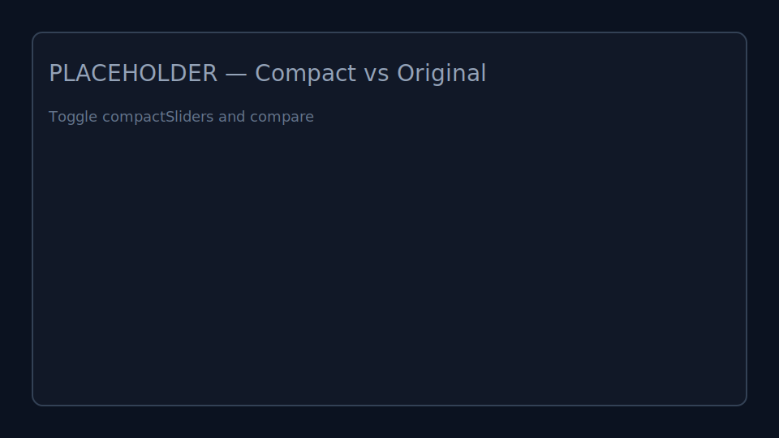

# Tweakpane Compact Kit

Compact layout toolkit for Tweakpane v4. Ship dense, tidy panels in ~320px without hacks.

- SplitLayout — build rows/columns with gutters; mount child panes or DOM per slot.
- SizedButton — multi‑line buttons sized by “units” aligned with the blade grid.
- Smart compaction — trims visual gaps; optional compact slider/value layout.

Works with the official v4 plugin API only (core.major = 2).

## Links

- Website (Tweakpane): https://tweakpane.github.io/
- Docs (Plugin Dev): https://tweakpane.github.io/docs/plugins/dev/
- NPM (Package): https://www.npmjs.com/package/tweakpane-compact-kit
- Demo (Repo): demo/ (run `npm run demo`)
- Demo (Pages): https://spiriteddragonet.github.io/tweakpane-compact-kit/ (if enabled)

## Install

```bash
npm install tweakpane-compact-kit
```

CDN (UMD) example:

```html
<script src="https://unpkg.com/tweakpane@4/dist/tweakpane.min.js"></script>
<script src="https://unpkg.com/tweakpane-compact-kit/dist/tweakpane-compact-kit.umd.js"></script>
<script>
  const pane = new Tweakpane.Pane();
  pane.registerPlugin(TweakpaneCompactKit.CompactKitBundle);
  // ...
  // pane.addBlade({ view: 'split-layout', ... });
  // pane.addBlade({ view: 'sized-button', ... });
  // ...
</script>
```

## Getting Started

Register the bundle (includes both SplitLayout and SizedButton) for every Pane you create.

```ts
import { Pane } from 'tweakpane';
import { CompactKitBundle } from 'tweakpane-compact-kit';

const pane = new Pane();
pane.registerPlugin(CompactKitBundle); // register per Pane

// 1) A simple row: 1fr | 1fr
const row = pane.addBlade({
  view: 'split-layout', direction: 'row', sizes: '1fr 1fr', children: ['leaf', 'leaf']
});

const [L, R] = row.getSlots();

// Left: 3-unit button
const pL = new Pane({ container: L }); pL.registerPlugin(CompactKitBundle);
pL.addBlade({ view: 'sized-button', title: 'Run\nAction', units: 3 });

// Right: 3-unit DOM box (plain HTML)
const box = document.createElement('div');
box.style.height = 'calc(3 * var(--cnt-usz) + 2 * 4px)';
box.style.display = 'grid';
box.style.placeItems = 'center';
box.textContent = '3u DOM';
R.appendChild(box);
```

Tip: use `CompactKitBundle` on nested panes too.

Screenshot (Basics 1/3):


## Demo Overview

The demo is split for progressive teaching. Each block hosts its own `split-layout` rows.

- Basics 1/3 — First Split (1fr | 1fr): left 3u `sized-button`, right 3u DOM
  
  

- Basics 2/3 — Size Expressions
  - 66 / 34 → two 2u buttons（66%/34%）
  - equal (3 cols) → three 2u buttons
  - 1fr 2fr → left title `1fr`, right `2fr`
  - 40 10 (normalized) → two 2u buttons（40:10 → 80:20）
  
  

- Basics 3/3 — Mixed DOM
  - Donut Gauge + Controls — left: Value/Thickness/Rounded/Color；right：4u donut gauge（Color 的 label 设为 '' 以隐藏仅这一项标签）
  
  

The demo source in `demo/` builds these blocks plus extra sections below.

### Compact Sliders Toggle
- Compare compact vs. original slider layout side by side.
- Toggle `compactSliders` to scale slider surface and reposition numeric inputs without breaking value editing.



### Custom Categories (Semantic Leaves)
- Use your own strings instead of `'leaf'` in `children` (e.g., `'alpha'`, `'beta'`).
- Fill slots by category using the API (`getSlotsByCategory`, `getSlotsByCategoryMap`).


## SplitLayout

Create flexible splits and mount child panes into returned slots.

```ts
const api = pane.addBlade({
  view: 'split-layout',
  direction: 'row',          // 'row' | 'column'
  sizes: '1fr 2fr',          // see “Size Expressions” below
  gutter: 6,                 // px
  interactive: false,        // static by default
  children: ['leaf', 'leaf'] // one slot per child
});

const [a, b] = api.getSlots();
```

Size Expressions (pick what reads best for your case):

```ts
// Numeric arrays (auto-normalized ratios)
sizes: [66, 34]       // 66:34 ratio
sizes: [1, 2, 1]      // 1:2:1 ratio

// Fractions (CSS Grid-like, recommended)
sizes: '1fr 2fr'      // 1:2 ratio
sizes: '1fr 1fr 1fr'  // 1:1:1 ratio

// Equal split
sizes: 'equal'        // auto-equal from children count
```

Other options:

```ts
gutter?: number | string // default 6
minSize?: number         // default 20 (min % per panel)
height?: number | string // for column splits
interactive?: boolean    // enable dragging
compactSliders?: boolean // compact slider/value layout (default true)
```

Imperative API:

```ts
api.getSlots(): HTMLElement[]
api.getSlotsByCategory(name: string): HTMLElement[]
api.getSlotsByCategoryMap(): Map<string, HTMLElement[]>
api.getCategories(): string[]
```

Children can be strings (categories) or nested split nodes. Strings are user-defined categories (e.g. `'leaf'`, `'alpha'`, `'preview'`).

### Column Splits with Row Units

For vertical layouts, you can allocate per-row “units” aligned to Tweakpane’s blade unit size. The container height is computed automatically.

```ts
pane.addBlade({
  view: 'split-layout',
  direction: 'column',
  rowUnits: '1 1 2',   // top=1u, mid=1u, bottom=2u
  gutter: 6,
  children: ['leaf', 'leaf', 'leaf']
});
```

### Label Policy for Compact UIs

When using `SplitLayout`, you can wrap a Pane instance so `addBinding()` hides the label when a label is not provided or is an empty string:

```ts
const api = pane.addBlade({ view: 'split-layout', direction: 'row', sizes: '1fr', children: ['leaf'] }) as any;
const [slot] = api.getSlots();
const p = new Pane({ container: slot });
(api as any).wrapPane?.(p);
// This binding will hide the label because label is empty:
p.addBinding({ color: '#22d3ee' }, 'color', { label: '' });
```

## SizedButton

Buttons that span multiple blade rows. Height is computed from Tweakpane’s unit size (`--cnt-usz`) with gutter compensation so alignment stays tidy.

```ts
pane.addBlade({
  view: 'sized-button',
  title: 'Multi-line\nButton',
  units: 3,
  onClick: () => runAction()
});
```


## Complete Syntax (Concise Reference)

This section summarizes all supported options and expressions designed by this plugin.

- SplitLayoutParams
  - `view: 'split-layout'`
  - `direction: 'row' | 'column'`
  - `sizes?: SizeExpression` — panel size expression (row or column)
  - `children?: SplitLayoutNode[]` — one slot per child; strings are categories; objects are nested splits
  - `rowUnits?: SizeExpression` — for `direction: 'column'`; per-row “unit” allocation (overrides `sizes` and also determines container height)
  - `height?: number | string` — explicit height for column layout when not using `rowUnits`
  - `gutter?: number | string` — gap between panels in px (default `6`)
  - `minSize?: number` — min panel size in percentage units for interactive mode (default `20`)
  - `interactive?: boolean` — enable draggable gutters (default `false`)
  - `compactSliders?: boolean` — compact slider/value layout inside leaves (default `true`)

- SplitLayoutNode
  - `string` — category name (e.g., `'leaf'`, `'alpha'`, `'preview'`)
  - `{ view: 'split-layout', direction, sizes?, rowUnits?, children, minSize?, gutter?, height? }` — nested split node

- SizeExpression
  - `number[]` — ratios, auto-normalized (e.g., `[66,34]`, `[1,2,1]`)
  - `string` — whitespace-separated tokens:
    - `'equal'` — equal split from child count
    - `'1fr 2fr 1fr'` — CSS-Grid-like fractions
    - `'200px 1fr 30%'` — mix of px/fr/%; tokens are normalized to percentages

- Imperative API
  - `getSlots(): HTMLElement[]`
  - `getSlotsByCategory(name: string): HTMLElement[]`
  - `getSlotsByCategoryMap(): Map<string, HTMLElement[]>`
  - `getCategories(): string[]`
  - `wrapPane(pane)` — redefines `addBinding()` to hide label only when `label` is omitted或`''`

- SizedButtonOptions
  - `{ view: 'sized-button', title?: string, units?: number, onClick?: () => void }`
  - `units` is an integer ≥ 1. The label supports `\n` for multiline.

Example — nested layout with categories and fractions:

```ts
pane.addBlade({
  view: 'split-layout', direction: 'row', sizes: '1fr 2fr',
  children: [
    'leaf',
    { view: 'split-layout', direction: 'column', rowUnits: '1 1 2', children: ['alpha','beta','gamma'] }
  ]
});
```

Helper — mount without registering the plugin (shim):

```ts
import { addSplitLayout } from 'tweakpane-compact-kit';
const folder = pane.addFolder({ title: 'Host' });
const split = addSplitLayout(folder, { view: 'split-layout', direction: 'row', sizes: 'equal', children: ['leaf','leaf'] });
// split.getSlots(), split.dispose()
```

## Run the Demo

```bash
# build the library first
npm run build

# start the demo dev server (aliases src to local source)
npm run demo
```

Open the shown URL. Try the “Compact vs Original” section, drag gutters, and adjust the Donut Gauge.

If you use GitHub Pages, publish `demo/` or a simple index that loads it.

## TypeScript

Public types are exported:

```ts
import type {
  SplitDirection,
  SizeExpression,
  SizedButtonOptions
} from 'tweakpane-compact-kit';
```

## Notes

- Tweakpane v4 only; bundle `core.major = 2` for compatibility.
- Register `CompactKitBundle` for every Pane you create (nested panes too).
- Keep your Pane around ~300–340px wide for compact visuals (the demo uses ~320px).

## Release (Manual)

We provide a manual GitHub Actions workflow to build and publish a release with zipped artifacts (dist.zip, js-only.zip):

1) Create a tag that matches `package.json` version (or just use the input form):
   - Example: `v0.1.0` for version `0.1.0`
2) Go to Actions → “Release (manual)” → Run workflow
   - Inputs: `tag` (required), optional `name`/`draft`/`prerelease`
3) The job will:
   - Install deps → build → validate tag/version → zip dist → upload assets
   - Auto-generate release notes; GitHub appends source code zip/tar.gz automatically

## License

MIT

## Contributing

Issues and PRs are welcome.
