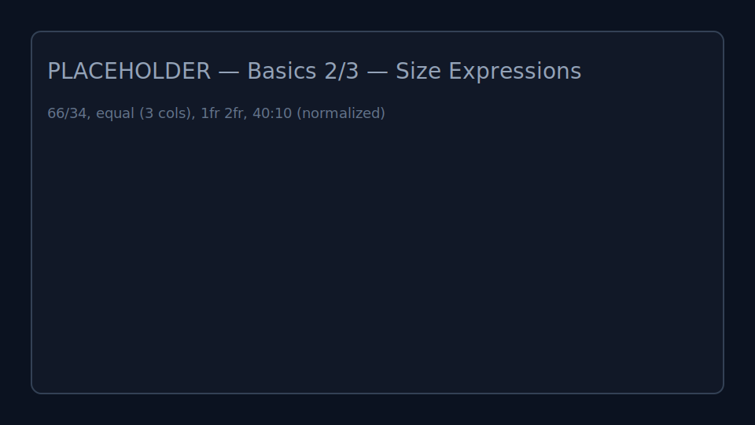
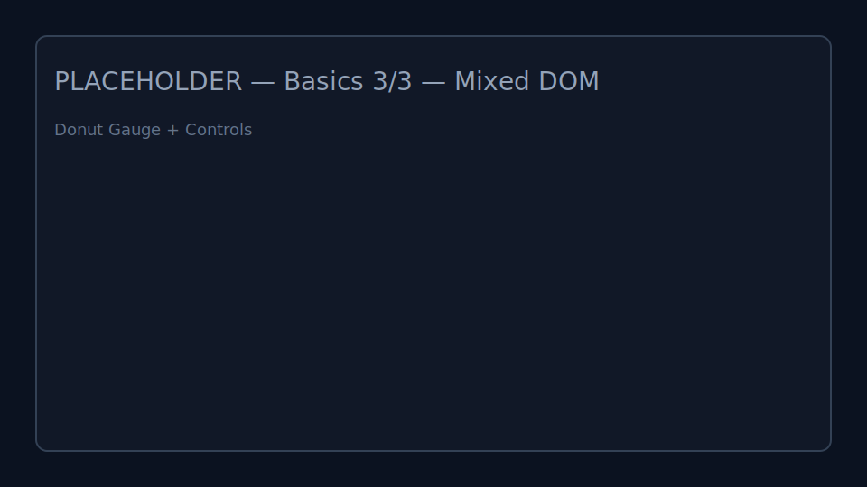
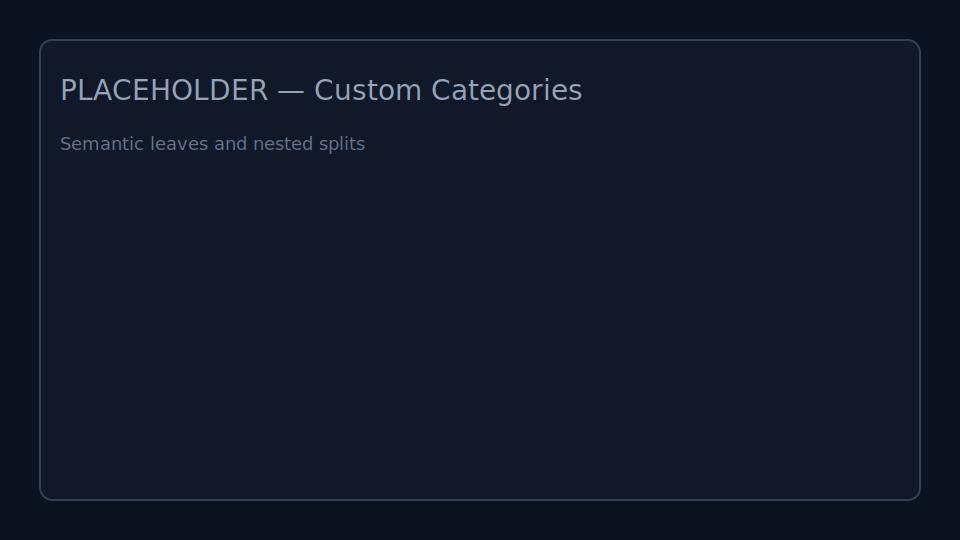

# Tweakpane Compact Kit

Compact layout toolkit for Tweakpane v4 — build dense, tidy panels in ~320px.

- SplitLayout: split by rows/columns and mount panes/DOM per slot
- SizedButton and BooleanButton: full-row buttons with shared icon/text content
- Optional compact slider/value layout

## Install

```bash
npm install tweakpane tweakpane-compact-kit
```

Peer dependency: tweakpane v4 (installed above)

## Basics

Minimal setup and common patterns you’ll use to build compact panes.

### Basics — Setup
Import once, create a Pane, and register the bundle (per Pane). All examples below assume this setup.

```js
import { Pane } from 'tweakpane';
import { CompactKitBundle } from 'tweakpane-compact-kit';

const pane = new Pane();
pane.registerPlugin(CompactKitBundle);
```

### Quick Start — First Split
Build one row with two slots: a 3u button (left) and a 3u DOM box (right).


<details>
<summary>View code</summary>

```js
// 1fr | 1fr with a small gutter
const row = pane.addBlade({
  view: 'split-layout',
  direction: 'row',
  sizes: '1fr 1fr',
  gutter: 6,
  children: ['leaf', 'leaf'],
});
const [L, R] = row.getSlots();

// Left: 3u button
const pL = new Pane({ container: L });
pL.registerPlugin(CompactKitBundle);
pL.addBlade({ view: 'sized-button', title: 'button (3u)', units: 3 });

// Right: explanatory text with controllable height (3u)
const text = document.createElement('div');
text.style.padding = '8px';
text.style.color = '#888';
text.style.fontSize = '10px';
text.style.lineHeight = '1.5';
text.textContent = 'Left: button (3u) — Right: Custom DOM with controllable height (3u)';
R.appendChild(text);
```

</details>

### Basics — Size Expressions
Four rows in one pane: equal (3 columns), `1fr 2fr`, `20 80`, and `1fr 2fr 2fr`. With the single geometry model, the first divider of `20 80` naturally lines up with `1fr 2fr 2fr`.



<details>
<summary>View code</summary>

```js
function mountRow(sizes, labels) {
  const row = pane.addBlade({
    view: 'split-layout',
    direction: 'row',
    sizes,
    children: labels.map(() => 'leaf'),
  });
  row.getSlots().forEach((slot, i) => {
    const p = new Pane({ container: slot });
    p.registerPlugin(CompactKitBundle);
    p.addBlade({ view: 'sized-button', title: labels[i], units: 2 });
  });
}

mountRow('equal', ['Equal 1', 'Equal 2', 'Equal 3']);
mountRow('1fr 2fr', ['1fr', '2fr']);
mountRow([20, 80], ['20', '80']);
mountRow('1fr 2fr 2fr', ['1fr', '2fr', '2fr']);
```

</details>

All row sizes share one geometry rule:

- `px` and `%` reserve a pre-cut span directly
- Bare numbers and `fr` values divide the remaining pre-cut span
- The final visible panel width is `span - gutter`

That is why `20 80`, `66 34`, and `200px 1fr 30%` can all stay in the same alignment system without a second layout mode.

## Mixed DOM — Custom Content
Show that you can place arbitrary DOM (canvas, charts, etc.) into any slot. Here we render a custom canvas on the right (4u) next to controls on the left.



<details>
<summary>View code</summary>

```js
// Row: controls | custom canvas
const gRow = pane.addBlade({ view: 'split-layout', direction: 'row', sizes: '1fr 1fr', gutter: 6, children: ['leaf','leaf'] });
const [gL, gR] = gRow.getSlots();
const state = { value: 64, thickness: 10, rounded: true, color: '#22d3ee' };

// left controls
const pL = new Pane({ container: gL });
pL.registerPlugin(CompactKitBundle);
pL.addBinding(state, 'value', { min: 0, max: 100, label: 'Value' });
pL.addBinding(state, 'thickness', { min: 4, max: 20, step: 1, label: 'Thickness' });
pL.addBinding(state, 'rounded', { label: 'Rounded' });
pL.addBinding(state, 'color', { label: '' });

// right custom canvas (4u)
const host = document.createElement('div');
host.style.height = 'calc(4 * var(--cnt-usz) + 3 * 4px)';
host.style.display = 'grid';
host.style.placeItems = 'center';
gR.appendChild(host);

function drawGauge(root: HTMLElement) {
  const canvas = document.createElement('canvas');
  const dpr = window.devicePixelRatio || 1;
  const w = root.clientWidth, h = root.clientHeight;
  canvas.width = Math.max(1, Math.floor(w * dpr));
  canvas.height = Math.max(1, Math.floor(h * dpr));
  canvas.style.width = '100%'; canvas.style.height = '100%';
  const ctx = canvas.getContext('2d'); if (!ctx) return;
  ctx.scale(dpr, dpr);
  const cx = w / 2, cy = h / 2; const r = Math.min(cx, cy) - state.thickness;
  // track
  ctx.lineWidth = state.thickness; ctx.strokeStyle = 'rgba(255,255,255,0.1)'; ctx.beginPath(); ctx.arc(cx, cy, r, 0, Math.PI*2); ctx.stroke();
  // value arc
  const start = -Math.PI/2, end = start + (Math.max(0, Math.min(100, state.value))/100) * Math.PI*2;
  ctx.lineCap = state.rounded ? 'round' : 'butt'; ctx.strokeStyle = state.color; ctx.beginPath(); ctx.arc(cx, cy, r, start, end); ctx.stroke();
  // text
  ctx.fillStyle = '#e5e7eb'; ctx.font = `${Math.floor(Math.min(w,h)*0.28)}px system-ui`; ctx.textAlign='center'; ctx.textBaseline='middle';
  ctx.fillText(`${Math.round(state.value)}%`, cx, cy);
  root.appendChild(canvas);
}

drawGauge(host);
```

</details>

## Button Extensions
Use `boolean-button` for real boolean bindings and `sized-button` for stateless actions. Both share the same icon/text content model, so the demo can mix compact-slider toggles, multi-unit boolean buttons, and regular action buttons without a second rendering path.

- `title` and top-level `icon` remain as shorthand
- `content` is the shared normalized shape: `{ text?: string; icon?: string | { path, viewBox? } }`
- `contentOn` is optional for `boolean-button`; missing fields inherit from base `content`

<details>
<summary>View code</summary>

```js
const icons = {
  sliders: { path: 'M3 4h10M2 8h12M5 12h6', viewBox: '0 0 16 16' },
  graph: { path: 'M2.5 11.5 6 8l2.5 2.5 5-6M3 3v10h10', viewBox: '0 0 16 16' },
};

const state = { compact: true, monitoring: false };

pane.addBinding(state, 'compact', {
  view: 'boolean-button',
  units: 2,
  content: {
    text: 'Compact Sliders\nOff',
    icon: icons.sliders,
  },
  contentOn: {
    text: 'Compact Sliders\nOn',
  },
  onColor: '#0ea5e9',
});

pane.addBinding(state, 'monitoring', {
  view: 'boolean-button',
  units: 3,
  content: {
    text: 'Monitor\nGraph',
    icon: icons.graph,
  },
  contentOn: {
    text: 'Monitoring\nGraph',
  },
  onColor: '#22c55e',
});

pane.addBlade({
  view: 'sized-button',
  units: 2,
  content: {
    text: 'Run\nAction',
    icon: icons.graph,
  },
});
```

</details>

In the demo, the `compact` boolean above is also fed back into a `split-layout` row via `compactSliders: state.compact`, so the pressed state and the slider layout stay tied to the same source of truth.

## Custom Categories
Use semantic leaf names (alpha/beta/gamma) and fill each slot with different controls. Below are two rows to match the screenshot.



<details>
<summary>View code</summary>

```js
// Row 1: 66/34 — alpha | beta
const row1 = pane.addBlade({
  view: 'split-layout', direction: 'row', sizes: [66, 34], children: ['alpha','beta']
});
const [a1, b1] = row1.getSlots();
// alpha: 3u action button
if (a1) {
  const p = new Pane({ container: a1 });
  p.addBlade({ view: 'sized-button', title: 'Run\nAction', units: 3 });
}
// beta: slider + checkbox + dropdown
if (b1) {
  const p = new Pane({ container: b1 });
  p.addBinding({ v: 42 }, 'v', { min: 0, max: 100, label: 'Level' });
  p.addBinding({ on: true }, 'on', { label: 'Enabled' });
  p.addBinding({ mode: 'a' }, 'mode', { options: { Alpha: 'a', Beta: 'b', Gamma: 'g' } });
}

// Row 2: equal — alpha | beta | gamma
const row2 = pane.addBlade({
  view: 'split-layout', direction: 'row', sizes: 'equal', children: ['alpha','beta','gamma']
});
const [a2, b2, g2] = row2.getSlots();
// alpha: button + text
if (a2) {
  const p = new Pane({ container: a2 });
  p.addButton({ title: 'Action' });
  p.addBinding({ text: 'hello' }, 'text');
}
// beta: number + color
if (b2) {
  const p = new Pane({ container: b2 });
  p.addBinding({ n: 3.14 }, 'n', { min: 0, max: 10 });
  p.addBinding({ c: '#22d3ee' }, 'c');
}
// gamma: simple toggle
if (g2) {
  const p = new Pane({ container: g2 });
  p.addBinding({ on: true }, 'on', { label: 'Enabled' });
}
```

</details>

## API Quick Reference

Supported public API highlights:

- `sizes`: `number[]`, `'equal'`, bare numeric strings, pure `fr` strings, and mixed strings such as `200px 1fr 30%`
- `px` and `%` tokens are pre-cut spans, not final visible widths
- `rowUnits`: `number[]`, `'equal'`, bare numeric strings such as `'1 1 2'`, and `fr` strings such as `'2fr 1fr 1fr'`
- `height`: row height for `direction: 'row'`; total column height for `direction: 'column'`, or derived from `rowUnits` when omitted
- `boolean-button`: boolean binding view with `units`, `content`, `contentOn`, `onColor`, and `offColor`
- `gutter`, `interactive`, `compactSliders`, and semantic `children` categories are supported

Short, common calls you’ll use most:

<details>
<summary>View code</summary>

```ts
// split layout
const api = pane.addBlade({
  view: 'split-layout', direction: 'row', sizes: '1fr 2fr', children: ['leaf','leaf']
});

// slots
api.getSlots();
api.getSlotsByCategory?.('alpha');

// vertical units
pane.addBlade({
  view: 'split-layout', direction: 'column', rowUnits: '1 1 2', children: ['leaf','leaf','leaf']
});

// compact sliders
pane.addBlade({ view: 'split-layout', direction: 'row', compactSliders: true, children: ['leaf'] });

// boolean button
pane.addBinding(state, 'enabled', {
  view: 'boolean-button',
  units: 2,
  content: { text: 'Enabled' },
  contentOn: { text: 'Enabled\nOn' },
});

// sized button
pane.addBlade({
  view: 'sized-button',
  units: 3,
  content: { text: 'Multi-line\nButton' },
});
```

</details>

(See demo/ for more recipes)

## Run the Demo

```bash
# build the library first
npm run build

# start the demo dev server (aliases src to local source)
npm run demo
```

Open the shown URL; try compact sliders, drag gutters, and the gauge.

## TypeScript
Public types are exported: `SplitDirection`, `SizeExpression`, `SizedButtonOptions`, `BooleanButtonOptions`.

## Notes
- Tweakpane v4 only (core.major = 2)
- Register `CompactKitBundle` per Pane (nested panes too)
- Keep Pane ~300–340px wide for clean visuals (~320px in demo)


## License

MIT

## Contributing

Issues and PRs are welcome.
